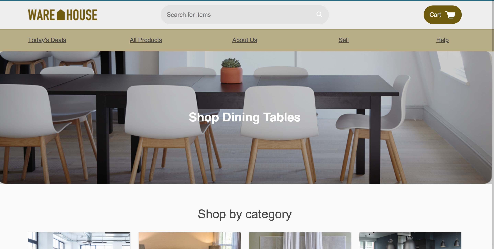

#Capstone Project: Warehouse Site

##Code Academy: Build Website UI Course

### By Rebecca York Hanlon - March 20, 2018

#### Objectives:

Step 1. Review data and get a clear understanding of the company’s goals, their data and what opportunities and challenges are present, then create a [create a design proposal](https://docs.google.com/document/d/1BLBkQKoFwtZiFqlwlRewmw1xNh7XoCrC7rMaZcfPL0g/edit).

Step 2. Implement changes to the site based on _user stories_.

